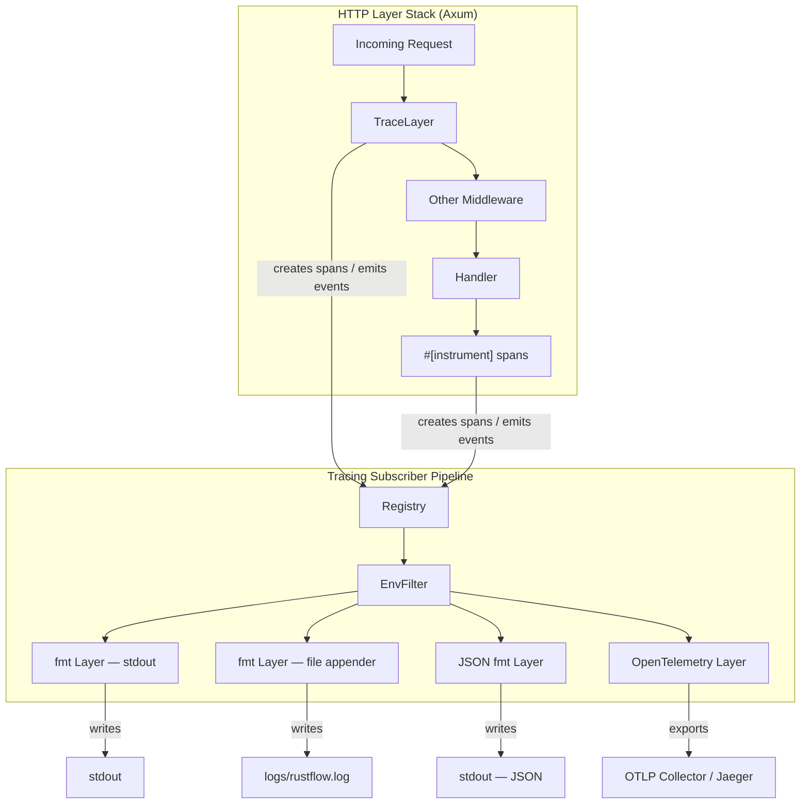
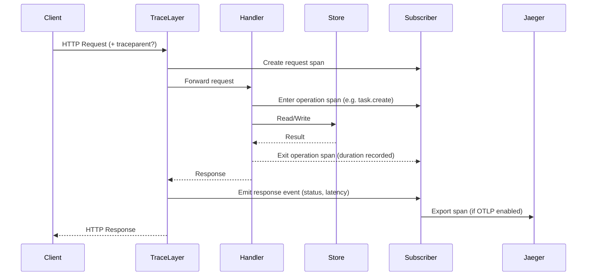

# Design Document — Section 3: Tracing

## Overview

Section 3 replaces RustFlow's ad-hoc `println!` logging with the `tracing` ecosystem, giving the service structured, filterable, multi-destination observability. The work progresses incrementally across nine sub-sections (3.1–3.9), each building on the previous one:

1. **Basic init** — wire up `tracing-subscriber` with a `fmt` layer to stdout
2. **EnvFilter** — control verbosity per crate/module via `RUST_LOG`
3. **TraceLayer** — automatic HTTP request/response logging via `tower-http`
4. **Timing spans** — instrument store operations with named spans
5. **Custom Axum spans** — enrich per-request spans with domain fields (request ID, entity ID, client name)
6. **File logging** — add a rotated file appender alongside stdout
7. **JSON output** — structured JSON formatting for log aggregation
8. **OpenTelemetry** — export spans to an OTLP collector (Jaeger)
9. **Distributed trace propagation** — inject/extract W3C `traceparent` headers on outbound/inbound HTTP

All tracing initialization logic lives in a new module `rustflow-common/src/tracing.rs`, keeping the server crate focused on routing and business logic. The server's `main.rs` calls the init function before binding the TCP listener, and the existing `log_request` / `log_elapsed_time` middleware functions are retired in favour of `TraceLayer`.

### Key Design Decisions

| Decision | Rationale |
|---|---|
| Tracing module in `rustflow-common` | Reusable across future crates (`rustflow-notifications`, `rustflow-db`) |
| Layered subscriber with `tracing_subscriber::registry()` | Composable — each feature (fmt, file, JSON, OTLP) is an independent layer |
| `EnvFilter` with a compiled-in default | Zero-config dev experience; production overrides via `RUST_LOG` |
| `tower-http::trace::TraceLayer` replaces custom middleware | Battle-tested, integrates natively with the tracing span lifecycle |
| `tracing-appender` for file rotation | Non-blocking writer with daily rotation, no external log-rotate dependency |
| Feature-gated OpenTelemetry | Avoids pulling heavy OTLP dependencies when not needed |

## Architecture

The tracing subsystem is a **layered subscriber pipeline** assembled at startup. Each layer is optional and toggled by configuration or Cargo features.



### Where tracing touches the codebase

| File | Change |
|---|---|
| `rustflow-common/Cargo.toml` | Add `tracing`, `tracing-subscriber`, `tracing-appender`, optional `opentelemetry` deps |
| `rustflow-common/src/lib.rs` | Re-export the new `tracing` module |
| `rustflow-common/src/tracing.rs` | **New file** — `init_tracing()` and helpers |
| `rustflow-server/Cargo.toml` | Add `tracing`, `tower-http` trace feature |
| `rustflow-server/src/main.rs` | Call `init_tracing()` before listener bind; replace `println!` calls |
| `rustflow-server/src/routes/middleware.rs` | Remove `log_request`, `log_elapsed_time`; keep `require_api_key`, `request_counter`, `rate_limited` |
| `rustflow-server/src/routes/tasks.rs` | Replace `println!` with `tracing::info!` / `tracing::debug!`; add `#[instrument]` |
| `rustflow-server/src/routes/*.rs` | Same `println!` → `tracing` migration in other route modules |
| `rustflow-server/src/errors.rs` | Add `tracing::warn!` / `tracing::error!` in error response conversion |

### Subscriber Assembly (Pseudocode Flow)

The `init_tracing()` function in `rustflow-common/src/tracing.rs` follows this logic:

1. Build an `EnvFilter` — try `RUST_LOG` env var, fall back to a compiled default like `rustflow_server=debug,rustflow_common=debug,tower_http=debug,warn`
2. Start with `tracing_subscriber::registry()`
3. Always add the `EnvFilter` layer
4. If JSON mode → add `fmt::layer().json()` targeting stdout
5. Else → add `fmt::layer()` (human-readable) targeting stdout
6. If file logging enabled → create a `tracing_appender::rolling::daily()` writer, wrap in `NonBlocking`, add another `fmt::layer()` targeting that writer
7. If OpenTelemetry enabled → build an OTLP pipeline, add the `tracing-opentelemetry` layer
8. Call `.init()` on the assembled subscriber

This layered approach means each sub-section (3.1–3.9) adds one more layer to the pipeline without disturbing the others.

## Components and Interfaces

### 1. Tracing Module (`rustflow-common/src/tracing.rs`)

This is the central piece. It exports a public initialization function and supporting types.

**Public interface:**

- `init_tracing(config: TracingConfig)` — assembles and installs the global subscriber. Must be called exactly once, before any tracing macros fire.
- `TracingConfig` — a struct (or builder) that controls which layers are active:
  - `json_output: bool` — use JSON formatting instead of human-readable
  - `log_directory: Option<PathBuf>` — enable file logging to this directory
  - `otlp_endpoint: Option<String>` — enable OpenTelemetry export to this URL
  - `default_filter: String` — the fallback `EnvFilter` directive when `RUST_LOG` is unset

**Internal helpers:**

- `build_env_filter(default: &str) -> EnvFilter` — reads `RUST_LOG` or uses the default
- `build_file_layer(dir: &Path) -> impl Layer` — creates the rolling file appender layer
- `build_otel_layer(endpoint: &str, service_name: &str) -> impl Layer` — creates the OTLP exporter layer

### 2. TraceLayer Configuration (`rustflow-server`)

The server configures `tower_http::trace::TraceLayer` with custom callbacks:

- **`make_span_with`** — a closure or struct implementing `MakeSpan` that creates the per-request span. Fields: `http.method`, `http.uri`, `request_id` (generated UUID), optionally `client.name` from extensions, optionally entity `id` from path.
- **`on_response`** — logs the response status code and latency.
- **`on_failure`** — logs errors at `ERROR` level.

This `TraceLayer` replaces the existing `log_request` and `log_elapsed_time` middleware in the router stack.

### 3. Instrumented Handlers

Route handlers and store operations use `tracing` macros:

- `#[tracing::instrument]` on handler functions — automatically creates a span with function name and selected arguments
- `tracing::info!`, `tracing::debug!`, `tracing::warn!` replace all `println!` calls
- Span fields like `task.id`, `project.id` are added via `#[instrument(fields(task.id = %id))]`

### 4. Trace Context Propagation

For distributed tracing (3.9):

- **Inbound**: The `TraceLayer` (or a dedicated middleware) extracts `traceparent` / `tracestate` headers from incoming requests and links them to the current span context.
- **Outbound**: Before making HTTP calls via `state.http_client`, the current span's trace context is injected as `traceparent` headers. This can be done via a reqwest middleware or a helper function that reads from `tracing::Span::current()` and sets headers on the `RequestBuilder`.

### Component Interaction Diagram



## Data Models

### TracingConfig

Drives the `init_tracing()` function. Passed from the server's startup code.

| Field | Type | Default | Description |
|---|---|---|---|
| `json_output` | `bool` | `false` | Use JSON formatting for stdout |
| `log_directory` | `Option<PathBuf>` | `None` | If `Some`, enable daily-rotated file logging |
| `otlp_endpoint` | `Option<String>` | `None` | If `Some`, enable OTLP trace export |
| `default_filter` | `String` | `"rustflow_server=debug,rustflow_common=debug,tower_http=debug,warn"` | Fallback when `RUST_LOG` is unset |

### Span Fields (per-request)

The custom `make_span` function creates spans with these fields:

| Field | Source | Example |
|---|---|---|
| `http.method` | Request method | `GET` |
| `http.uri` | Request URI path | `/api/tasks/42` |
| `request_id` | Generated `Uuid::new_v4()` | `a1b2c3d4-...` |
| `client.name` | `AuthenticatedClient` extension (if present) | `admin` |
| `entity.id` | Path parameter (if present) | `42` |

### Span Fields (operation-level)

Handler-level `#[instrument]` spans carry:

| Span Name | Fields | Example |
|---|---|---|
| `task.list` | filter params | `status=pending` |
| `task.create` | `task.id` (after creation) | `task.id=4` |
| `task.get` | `task.id` | `task.id=42` |
| `task.update` | `task.id` | `task.id=42` |
| `task.delete` | `task.id` | `task.id=42` |
| `project.list` | — | — |
| `project.create` | `project.id` | `project.id=1` |
| `user.list` | — | — |
| `user.create` | `user.id` | `user.id=1` |

### Log Event Structure (JSON mode)

When JSON output is enabled, each event is a single-line JSON object:

```json
{
  "timestamp": "2026-01-15T10:30:00.123Z",
  "level": "INFO",
  "target": "rustflow_server::routes::tasks",
  "message": "task created",
  "span": {
    "name": "task.create",
    "task.id": 4
  },
  "spans": [
    { "name": "HTTP request", "http.method": "POST", "http.uri": "/api/tasks", "request_id": "a1b2c3d4-..." }
  ]
}
```

### Crate Dependencies (additions to workspace)

| Crate | Purpose | Where |
|---|---|---|
| `tracing` | Core macros (`info!`, `debug!`, `#[instrument]`) | Both crates |
| `tracing-subscriber` | Subscriber registry, `fmt` layer, `EnvFilter` | `rustflow-common` |
| `tracing-appender` | Non-blocking file writer with rotation | `rustflow-common` |
| `tower-http` (trace feature) | `TraceLayer` for automatic HTTP span creation | `rustflow-server` |
| `opentelemetry` | Trace API (optional) | `rustflow-common` |
| `opentelemetry-otlp` | OTLP exporter (optional) | `rustflow-common` |
| `tracing-opentelemetry` | Bridge between `tracing` spans and OTel spans (optional) | `rustflow-common` |
| `opentelemetry-sdk` | OTel SDK runtime (optional) | `rustflow-common` |
| `uuid` | Request ID generation | `rustflow-server` (already present) |


## Correctness Properties

*A property is a characteristic or behavior that should hold true across all valid executions of a system — essentially, a formal statement about what the system should do. Properties serve as the bridge between human-readable specifications and machine-verifiable correctness guarantees.*

### Property 1: EnvFilter respects RUST_LOG directives

*For any* valid `RUST_LOG` directive string, when the environment variable is set before calling `init_tracing()`, the resulting `EnvFilter` should parse successfully and apply those directives instead of the compiled-in default.

**Validates: Requirements 2.1, 2.3**

### Property 2: Request span contains method, URI, and unique request ID

*For any* HTTP request processed by the TraceLayer, the per-request span should contain the `http.method`, `http.uri`, and a `request_id` field. Furthermore, *for any* two distinct requests, their `request_id` values should be different.

**Validates: Requirements 3.2, 5.2**

### Property 3: Response event contains status code and latency

*For any* HTTP request/response cycle, the TraceLayer should emit a response event containing the HTTP status code and a non-negative latency duration.

**Validates: Requirements 3.3**

### Property 4: Store operations create named spans

*For any* store operation (task, project, or user — read or write), the handler should enter a span whose name matches the operation (e.g., `task.list`, `task.create`, `project.list`, `user.create`).

**Validates: Requirements 4.1, 4.2**

### Property 5: Entity ID appears in span fields when available

*For any* store operation that targets a specific entity by ID, the operation span should include that entity's ID as a structured field.

**Validates: Requirements 4.3, 5.4**

### Property 6: Authenticated client name in request span

*For any* HTTP request where an `AuthenticatedClient` is present in the request extensions, the per-request span should include the `client.name` field matching the authenticated client's name.

**Validates: Requirements 5.3**

### Property 7: Dual output when file logging is enabled

*For any* tracing event emitted while file logging is enabled, the event should be written to both stdout and the log file.

**Validates: Requirements 6.3**

### Property 8: JSON output produces valid JSON with required fields

*For any* tracing event emitted in JSON mode, the output line should be valid JSON and contain at minimum the keys: `timestamp`, `level`, `target`, and `message`.

**Validates: Requirements 7.2**

### Property 9: Outbound requests carry valid W3C traceparent

*For any* outbound HTTP request made within an active span context, the request should include a `traceparent` header whose value matches the W3C TraceContext format: `{version}-{trace-id}-{parent-id}-{trace-flags}` (e.g., `00-{32 hex}-{16 hex}-{2 hex}`).

**Validates: Requirements 9.1, 9.3**

### Property 10: Inbound traceparent is extracted and continued

*For any* inbound HTTP request carrying a valid `traceparent` header, the span created by the TraceLayer should be a child of the trace identified in that header (i.e., the span's trace ID should match the incoming trace ID).

**Validates: Requirements 9.2**

## Error Handling

| Scenario | Behaviour | Requirement |
|---|---|---|
| `RUST_LOG` contains an invalid directive | `EnvFilter` falls back to the compiled-in default; a warning is emitted to stderr | 2.1 |
| Log directory does not exist or is not writable | `init_tracing()` logs a warning to stdout and skips the file layer; the application continues normally | 6.4 |
| OTLP collector is unreachable at startup | The OpenTelemetry layer is installed but export failures are non-blocking; a warning is logged | 8.5 |
| OTLP collector becomes unreachable at runtime | The exporter retries according to its backoff policy; failed exports are dropped without blocking request handling | 8.5 |
| `tracing::subscriber::set_global_default` called twice | Panics — `init_tracing()` must be called exactly once. The server's `main()` is the single call site | — |
| `NonBlockingWorkerGuard` dropped prematurely | Buffered log events may be lost. The guard must be held for the lifetime of the application (store it in `main()`) | 6.2 |

### Guard Lifetime Pattern

When using `tracing-appender`'s `NonBlocking` writer, the returned `WorkerGuard` must be kept alive for the entire application lifetime. If it's dropped, the background writer thread stops and buffered events are lost. The `init_tracing()` function should return the guard (or an `Option<WorkerGuard>`), and `main()` should bind it to a variable that lives until shutdown:

```
let _guard = init_tracing(config);
// _guard lives until main() returns → all buffered events are flushed
```

This is a common pitfall — if the guard is not captured, it's immediately dropped and file logging silently stops working.

## Testing Strategy

### Unit Tests

Unit tests cover specific examples and edge cases. They should be written for:

- **EnvFilter default**: When `RUST_LOG` is unset, verify the default filter string is applied (Req 2.2)
- **EnvFilter override**: Set `RUST_LOG` to a known value, verify it takes precedence (Req 2.3)
- **Invalid log directory**: Pass a non-existent path, verify no panic and a warning is emitted (Req 6.4)
- **JSON mode toggle**: Verify JSON mode produces parseable JSON; non-JSON mode does not (Req 7.2, 7.3)
- **OTLP service name**: When OTel is configured, verify the resource attribute `service.name` equals `APP_NAME` (Req 8.3)
- **TracingConfig defaults**: Verify `TracingConfig::default()` produces sensible values
- **Unreachable collector**: Configure OTLP with a bogus endpoint, verify the server starts without blocking (Req 8.5)

### Property-Based Tests

Property-based tests verify universal properties across generated inputs. Use the `proptest` crate (Rust's standard PBT library). Each test should run a minimum of 100 iterations.

Each property test must be tagged with a comment referencing the design property:

```
// Feature: section3-tracing, Property 1: EnvFilter respects RUST_LOG directives
```

**Property tests to implement:**

1. **EnvFilter parsing** (Property 1): Generate random valid `RUST_LOG` directive strings (combinations of `crate=level` directives). Verify `EnvFilter::try_new()` succeeds for all of them.

2. **Request span fields** (Property 2): Generate random HTTP method + URI combinations. Send them through the TraceLayer with a test subscriber. Verify the span contains `http.method`, `http.uri`, and a non-empty `request_id`.

3. **Response event fields** (Property 3): Generate random requests that produce various status codes. Verify the response event contains the status code and a non-negative latency.

4. **Store operation span names** (Property 4): Generate random operation types (list, create, get, update, delete) across all domains (task, project, user). Verify the span name matches `{domain}.{operation}`.

5. **Entity ID in span** (Property 5): Generate random entity IDs. Invoke operations that target specific entities. Verify the span includes the entity ID field.

6. **Client name in span** (Property 6): Generate random `AuthenticatedClient` values. Send requests with those clients in extensions. Verify the span includes `client.name`.

7. **Dual output** (Property 7): Generate random log messages with file logging enabled. Verify the message appears in both the captured stdout and the log file.

8. **JSON structure** (Property 8): Generate random log events in JSON mode. Parse each output line as JSON. Verify the presence of `timestamp`, `level`, `target`, and `message` keys.

9. **Outbound traceparent format** (Property 9): Generate random span contexts. Make outbound requests within those contexts. Verify the `traceparent` header matches the regex `^00-[0-9a-f]{32}-[0-9a-f]{16}-[0-9a-f]{2}$`.

10. **Inbound trace continuation** (Property 10): Generate random valid `traceparent` header values. Send inbound requests with those headers. Verify the resulting span's trace ID matches the one from the header.

### Integration Tests

Integration tests (planned for Section 9) will cover end-to-end scenarios:

- Start the server, send requests, verify structured log output appears on stdout
- Start the server with file logging, send requests, verify log files are created and contain events
- Start the server with a Jaeger instance, send requests, verify traces appear in Jaeger UI
- Send a request with a `traceparent` header, make an outbound call, verify the trace ID propagates

### Test Configuration

- PBT library: `proptest` (add to `[dev-dependencies]`)
- Minimum iterations per property test: 100
- Test subscriber: use `tracing-subscriber`'s `TestWriter` or a custom `Layer` that captures events into a `Vec` for assertion
- For tests that need to capture tracing output, use `tracing::subscriber::with_default()` to install a test-scoped subscriber (avoids global state conflicts between tests)
